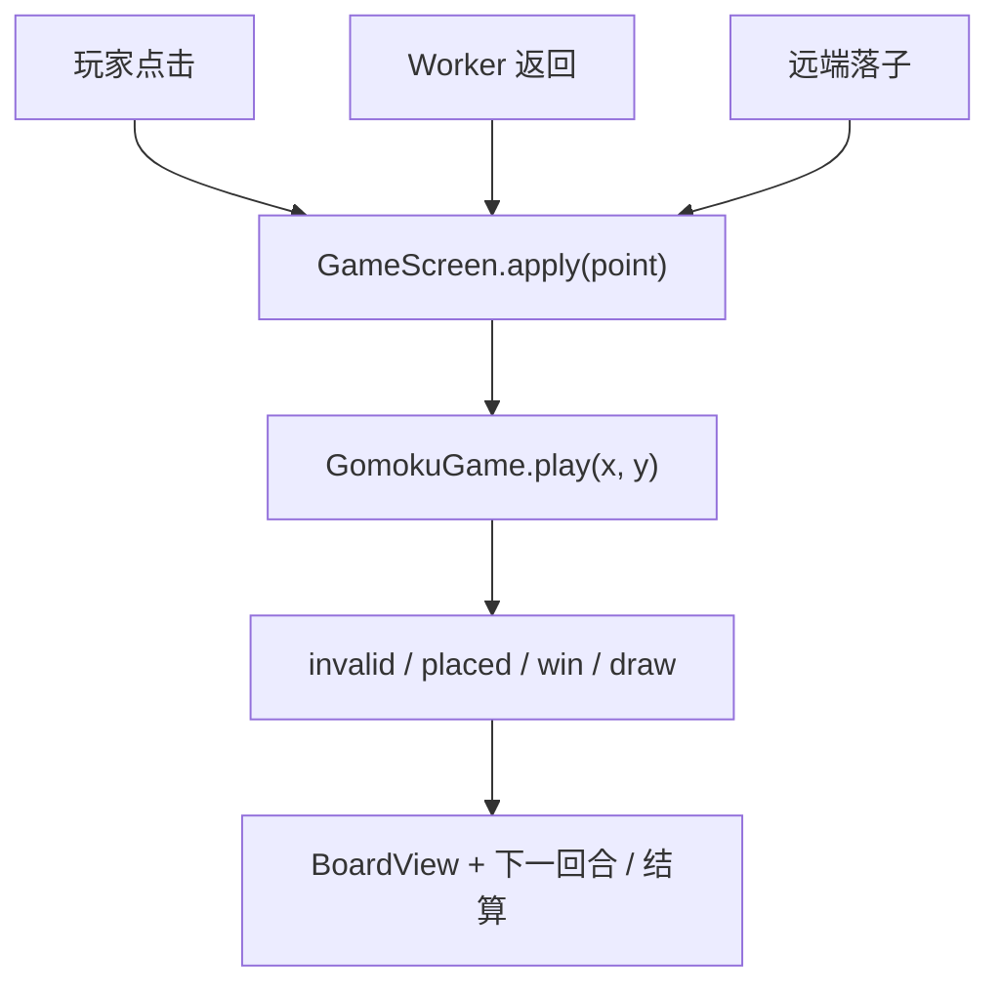
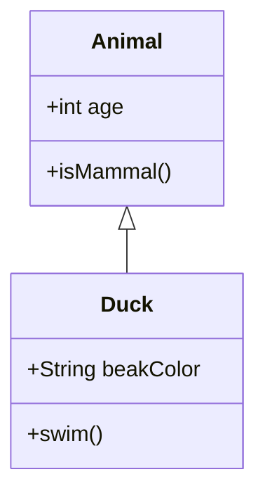

# 文章图表

编辑器的插入菜单中选择 **Code Drawing**，或在空段落输入 `/mermaid` 后选择 Code Drawing。格式菜单提供 Mermaid、PlantUml、Graphviz、Flowchart；视图菜单提供「源码与图表」「仅源码」「仅图表」。

输入 `/excalidraw` 或从插入菜单选择 **Excalidraw** 可打开手绘画布。保存文章会保留图形、画布背景及嵌入图片，重新编辑时仍可继续修改。文章页显示静态图，并提供 SVG 和 `.excalidraw` 源文件下载。

普通代码块的语言设为 `mermaid`、`plantuml` / `puml`、`graphviz` / `dot` 或 `flowchart`，文章页也会识别为图表。其他代码语言继续语法高亮。普通文本/ASCII 箭头不会自动转换；需改写成对应语法。

例如五子棋的调用流程可以写为：

类图使用 Mermaid 的 `classDiagram`，不是普通代码高亮：

Mermaid、Graphviz、Flowchart 和 Excalidraw 在浏览器内渲染。PlantUML 使用官方 `plantuml.com` 服务，会向该服务发送图表源码，编辑器选择此格式时会提示。渲染失败时保留源码，文章页可重试。

开发约定：`editor-widget-url.ts` 固定同一个编辑器提交版本，`web-component.js` 用于编辑，独立的 `drawings.js` 用于文章展示。文章页仅在图表接近可视区域时加载绘图依赖，且将 SVG 作为图片显示，不插入可执行的 SVG HTML。完整 Slate JSON 是持久化来源，不要只存图表的空文本子节点。

官方说明：[Plate Code Drawing](https://platejs.org/docs/code-drawing)、[Plate Excalidraw](https://platejs.org/docs/excalidraw)。
